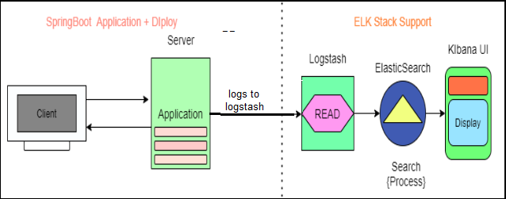
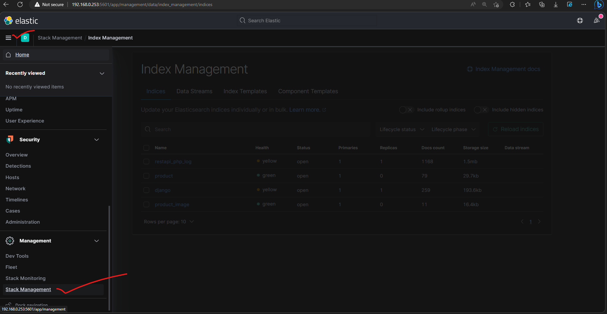
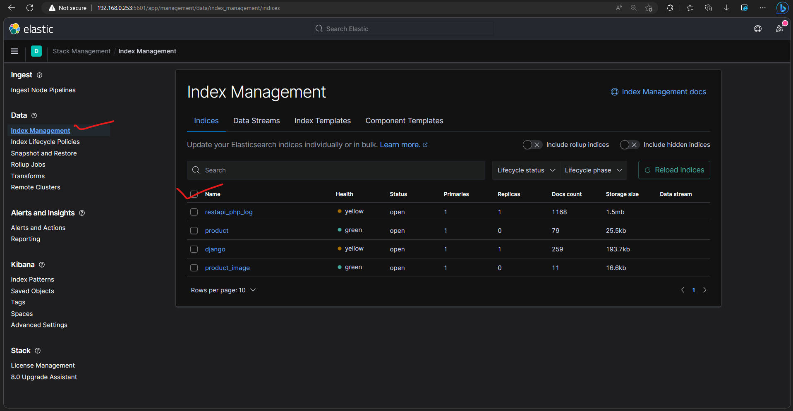
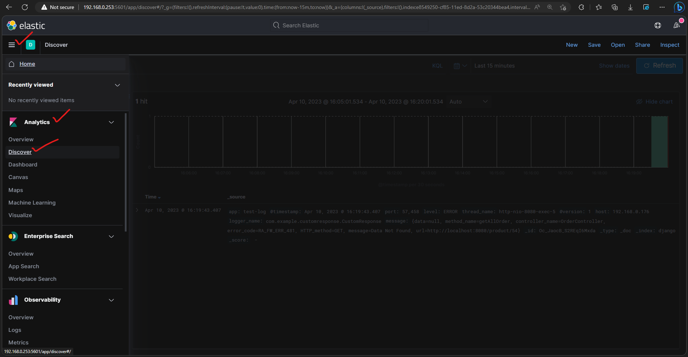
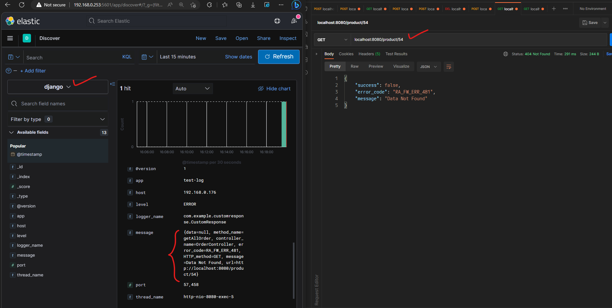

# Error-Logging-Elk Application Development
Simple Error-Logging-Elk SpringBoot Application Development with Docker using ElasticSearch Logstash and Kibana Development

## Steps to run sample

```
    # Run Error-Logging-Elk SpringBoot Application 
    mvn spring-boot:run
    
    # Start docker containers 
    docker-compose up -d
```

## Application contains 3 modules:

    1) customer
    2) product
    3) order
        1) orderDetails


## ELK Stack
Any application will be deployed in a location that provides a log message to a Logfile.
A text type internally ,Searching details (Error, Warning) is a bit complex task So,we are using ELK for easy search of log file data.

ElasticSearch-https://www.elastic.co/elasticsearch <br>
Logstash-https://www.elastic.co/logstash <br>
Kibana-https://www.elastic.co/kibana <br>

    1)ElasticSearch :    Search Engine (based on JSON) Distributed even ,Supports Analytics.

    2)Logstash :         Logstash is an open source data collection engine with real-time pipelining capabilities.
       Logstash can dynamically unify data from disparate sources and normalize the data into destinations of your choice. 
       Cleanse and democratize all your data for diverse advanced downstream analytics and visualization use cases.

    3)Kibana :           UI where it will display our file data 

```
ElasticSearch server url - http://192.168.0.253:9200/
Logstash server url      - http://192.168.0.253:5959
kibana server url        - http://192.168.0.253:5601/
```
    ELK Integration with springboot application


    To check index created or not & use kibana url on browser
     click on menu bar after that click on stack management

    And then click on index management chek your index name if showing your index created successfully

    To check logs click on menu bar after that click on Analytics then click on Discover


    send any request and check if success response is false click on your index name and check logs 
    here we are getting HTTP_Method,controller & method name associated with request,errorCode,message,url

